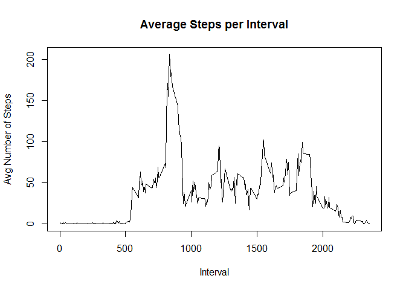

# Reproducible Research: Peer Assessment 1
Zach Zaccaro  
June 13th, 2015  
## About
This was the first assignment for the **Reproducible Research** course in Coursera's Data Science specialization track. Our goal was to write a report using R Markdown and knitr to answer various questions based on the given data. 

This assignment makes use of data from a personal activity monitoring device. This device collects data at 5 minute intervals through out the day. The data consists of two months of data from an anonymous individual collected during the months of October and November, 2012 and include the number of steps taken in 5 minute intervals each day.

## Data
The data for this assignment was downloaded from the course web
site:

* Dataset: [Activity monitoring data](https://d396qusza40orc.cloudfront.net/repdata%2Fdata%2Factivity.zip) [52K]

The variables included in this dataset are:

* **steps**: Number of steps taking in a 5-minute interval (missing
    values are coded as `NA`)

* **date**: The date on which the measurement was taken in YYYY-MM-DD
    format

* **interval**: Identifier for the 5-minute interval in which
    measurement was taken

The dataset is stored in a comma-separated-value (CSV) file and there are a total of 17,568 observations in this dataset.

## I. Loading and preprocessing the data
### Load necessary libraries and fix scientific notation.

```r
library(lattice)
options(scipen = 1) # Turn off scientific notation
```
### Unzip and load the data into a data frame.

```r
if(!file.exists("activity.csv")) {
    unzip("activity.zip")
}
data <- read.csv("activity.csv", header = T)
```


## II. What is the mean total number of steps taken per day?
### 1.) Calculate the total number of steps taken per day and store it.

```r
steps_per_day <- aggregate(steps ~ date, data, FUN = "sum")
```
### 2.) Create a histogram of the total number of steps taken each day.

```r
hist(steps_per_day$steps, main="Total Steps per Day", xlab="Number of Steps", col="green")
```

 
  
### 3.) Calculate the mean and median of the number of steps taken per day.

```r
mean <- round(mean(steps_per_day$steps), digits=3)
median <- median(steps_per_day$steps)
```
Mean: 10766.189  
Median: 10765

## III. What is the average daily activity pattern?
### 1.) Make a time series plot of the 5-minute interval and the average number of steps taken, averaged across all days.
* Calculate the average number of steps taken per 5-minute interval across all days and store it.
* Make a time series plot for the data.

```r
avg_steps_per_int <- aggregate(steps ~ interval, data, FUN = "mean")
plot(avg_steps_per_int$interval, avg_steps_per_int$steps, type="l", main="Average Steps per Interval", xlab="Interval", ylab="Avg Number of Steps")
```

 
  
### 2.) Find the 5-minute interval that contains the maximum average number of steps.

```r
max_int <- avg_steps_per_int[which.max(avg_steps_per_int$steps), 1]
```
Interval with Maximum Steps: 835

## IV. Imputing missing values  
### 1.) Calculate the number of missing values in the data.

```r
num_NA <- sum(is.na(data))
```
Number of NA's: 2304  
  
### 2.) Devise a strategy to fill in the missing values. My strategy was to use the mean of the particular 5-minute interval to fill in the missing value in the steps column. (steps are rounded to nearest whole number)

```r
tidy_Data <- data
for (i in 1:nrow(tidy_Data)) {
  if (is.na(tidy_Data$steps[i])) {
    num_steps <- avg_steps_per_int[which(tidy_Data$interval[i] == avg_steps_per_int$interval), 2]
    tidy_Data$steps[i] <- round(num_steps, digits = 0)
  }
}
```
  
### 3.) Create a histogram of the new data.

```r
new_steps_per_day <- aggregate(steps ~ date, tidy_Data, FUN = "sum")
hist(new_steps_per_day$steps, main="Total Steps per Day", xlab="Number of Steps", col="green")
```

 
  
### 4.) Calculate the mean and median of the number of steps taken per day. Compare them to the old ones.

```r
new_mean <- round(mean(new_steps_per_day$steps), digits=3)
new_median <- median(new_steps_per_day$steps)
```
Old Mean: 10766.189  
New Mean: 10765.639  
Old Median: 10765  
New Median: 10762  
  
Imputing the missing values lowers the mean and median of the total steps per day very slightly.  
  
## V. Are there differences in activity patterns between weekdays and weekends?
### 1.) Create a new factor variable in the dataset indicating whether a given date is a weekday or weekend day.  

```r
weekdays <- c("Monday", "Tuesday", "Wednesday", "Thursday", "Friday")
tidy_Data$dow <- as.factor(ifelse(is.element(weekdays(as.Date(tidy_Data$date)), weekdays), "Weekday", "Weekend"))
head(tidy_Data)
```

```
##   steps       date interval     dow
## 1     2 2012-10-01        0 Weekday
## 2     0 2012-10-01        5 Weekday
## 3     0 2012-10-01       10 Weekday
## 4     0 2012-10-01       15 Weekday
## 5     0 2012-10-01       20 Weekday
## 6     2 2012-10-01       25 Weekday
```
### 2.) Calculate the average steps per interval across all weekdays/weekends and plot the data.
  

```r
avg_steps_per_int2 <- aggregate(steps ~ interval + dow, tidy_Data, FUN = "mean")

xyplot(avg_steps_per_int2$steps ~ avg_steps_per_int2$interval|avg_steps_per_int2$dow, type="l", main="Average Steps per Interval",xlab="Interval", ylab="Average Number of Steps",layout=c(1,2))
```

 


